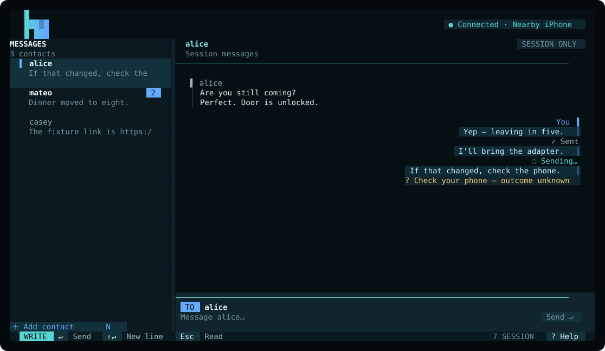

# Blupost

Blupost is a terminal-native Linux client for session-based one-to-one texting through a nearby, paired iPhone. Built because I wanted to text on my desktop. 




Blupost deliberately does not synchronize old conversations—each process starts with an empty, in-memory session and retains at most 500 messages across all live threads.

## Requirements

- Linux with BlueZ and the per-user `org.bluez.obex` service
- A paired iPhone with **Show Notifications** enabled for this computer in its Bluetooth settings
- Rust 1.87 or newer
- Bun 1.3.14 or newer

## Build and run

```sh
bun install --frozen-lockfile
bun run lint
bun run test
bun run build
bun ./bin/blupost.js doctor
bun ./bin/blupost.js
```

## Contacts and plain commands

```sh
bun ./bin/blupost.js contacts add alice +13125550123
bun ./bin/blupost.js contacts list
bun ./bin/blupost.js contacts update alice +13125550124
bun ./bin/blupost.js contacts remove alice

bun ./bin/blupost.js send alice "Running late"
bun ./bin/blupost.js send alice -- "--literal option-like message"
bun ./bin/blupost.js watch --plain
```

Contacts added from either the TUI or CLI live at `${XDG_CONFIG_HOME:-~/.config}/blupost/config.toml` with owner-only permissions. Updates share an empty owner-only lock file so concurrent Blupost processes cannot overwrite one another's changes. Phone selection is automatic:

```toml
[contacts]
alice = "+13125550123"
```

Motion is automatic, bounded, and state-driven: interactive terminals get the one-shot mark reveal and local arrival/sending/sent feedback, while non-TTY output and tests snap directly to final frames. Idle state is completely still.

## Privacy boundary

Blupost requests Bluetooth MAP access, not general iPhone filesystem or Apple Account access. TUI message bodies and drafts stay in process memory and cross the validated private child-process stdio seam. With the one-shot shell command, the recipient and body necessarily begin in the Bun launcher's arguments and may therefore be visible in shell history or same-user process inspection; the launcher forwards them to the native engine over private stdin instead of duplicating them into the engine's arguments.
